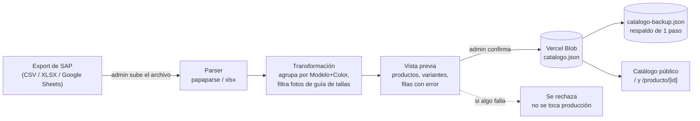
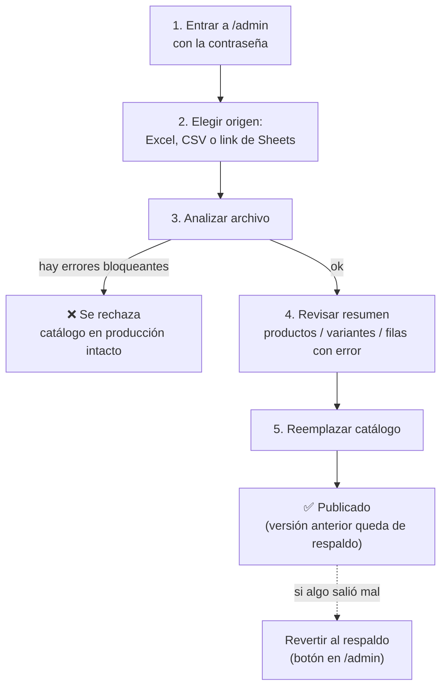

<div align="center">

# 👟 Catálogo Mayorista — Calzados Mesvol

**Catálogo digital de solo lectura para venta al mayor**, con carga de datos manual desde el export de SAP y cero base de datos.


</div>

---

## ¿Qué es esto?

El dueño del negocio comparte un **link público** con sus clientes mayoristas
para que naveguen el catálogo de calzado desde el celular (pensado para
compartirse por WhatsApp). No hay carrito ni checkout — es solo vista.

Un único administrador carga los datos entrando a `/admin` con una
contraseña, subiendo el archivo que exporta directamente desde SAP (o
pegando un link de Google Sheets). No hace falta tocar código para publicar
un catálogo nuevo.

| | |
|---|---|
| 🛍️ **Catálogo público** | `/` — grid con filtros, buscador, detalle de producto con carrusel de fotos y selector de talla |
| 🔐 **Panel admin** | `/admin` — un solo usuario, contraseña por variable de entorno, protegido con cookie firmada |
| 📦 **Almacenamiento** | Vercel Blob — un archivo JSON, sin PostgreSQL/Supabase/MySQL ni nada por el estilo |
| 📥 **Fuente de datos** | CSV, Excel (XLSX), o un Google Sheets publicado como CSV — export directo de SAP |

## Funcionalidades

- **Catálogo público:** grid responsive (2 columnas en celular, 3–4 en desktop), filtros por marca / género / color / rango de precio, buscador por modelo, estados vacíos y skeletons cuidados, imágenes con lazy loading y fallback si una foto rompe.
- **Detalle de producto:** carrusel de fotos, selector de talla (las agotadas se ven tachadas, no solo deshabilitadas), cantidad mínima por bulto, link aparte a la guía de tallas.
- **Panel de administración:** sube CSV/XLSX/link de Sheets → el sistema valida y muestra un **resumen previo** (productos detectados, variantes, filas con error) → el admin confirma explícitamente → recién ahí se reemplaza el catálogo en producción.
- **Respaldo de un paso:** antes de reemplazar, la versión anterior se guarda aparte. Si algo salió mal, un botón en `/admin` revierte al respaldo.
- **Validación estricta:** si faltan columnas obligatorias o el archivo no tiene ninguna fila válida, se rechaza el reemplazo completo — el catálogo en producción nunca queda a medio actualizar.

## Cómo funciona (arquitectura)



No hay base de datos relacional: `catalogo.json` **es** el catálogo. Cada
carga nueva lo reemplaza por completo (con respaldo automático de la versión
anterior).

## Stack técnico

| Pieza | Elección | Por qué |
|---|---|---|
| Framework | [Next.js 16](https://nextjs.org) (App Router) | SSR simple, rutas de API integradas, deploy nativo en Vercel |
| Lenguaje | TypeScript | tipado en la transformación de datos, donde más se necesita |
| Estilos | Tailwind CSS v4 | sistema de diseño consistente sin escribir CSS a mano |
| Parsing CSV | [papaparse](https://www.papaparse.com/) | estándar de facto, tolerante a archivos reales |
| Parsing Excel | [xlsx (SheetJS)](https://sheetjs.com/) | lee `.xlsx` sin depender de Excel/Google |
| Almacenamiento | [Vercel Blob](https://vercel.com/docs/storage/vercel-blob) | un JSON versionado a mano, cero mantenimiento de base de datos |

## Columnas del archivo de origen (SAP)

El export real es la hoja `OITM` de la "Lista de Precio al mayor": **una
fila por Modelo+Color+Rango de tallas** (no una fila por talla individual).
`U_PX_Serie` (rango, ej. `35-40`) + `U_PX_Curva` (pares por talla dentro de
ese rango, ej. `1-2-3-3-2-1`) se expanden en tallas individuales — el
sistema busca automáticamente, entre todas las hojas del archivo, la que
tenga una columna `ItemCode` (así no importa si el export trae hojas de
pivote/referencia antes que los datos reales).

| Columna en el SAP | Para qué se usa |
|---|---|
| `ItemCode` | código SAP de la fila — se muestra como "Código SAP" en el producto (obligatoria) |
| `U_PX_Modelo` | agrupador de producto (obligatoria) |
| `U_PX_Color` | agrupador de producto (obligatoria) |
| `U_PX_Marca` | marca — tarjeta de producto y filtro (obligatoria) |
| `U_PX_Rubro` | `CALZADO` expande Serie+Curva en tallas; cualquier otro valor (`ACCESORIOS`, etc.) se importa como talla única "Único", vendido por unidad (obligatoria) |
| `PV Fabrica` | precio de venta al mayor en USD (obligatoria) |
| `U_PX_Serie` + `U_PX_Curva` | rango y curva de tallas — obligatorias solo si `U_PX_Rubro` es `CALZADO` |
| `Disponible a Ofertar` | stock total del producto (no por talla); se reparte entre tallas según la proporción de la curva |
| `U_PX_Genero`, `U_PX_Linea` | metadata de producto — usadas en los filtros de género y línea |
| `U_Promocion` | `S` muestra una etiqueta "Promoción" en la tarjeta |
| `U_LinkImagenChasea` (o `Foto`) | foto del producto |

Ojo: varias columnas de precio del export real traen espacios ocultos en el
encabezado (ej. `" PV Fabrica "` en vez de `"PV Fabrica"`) — `parseOrigen.ts`
los recorta al leer el archivo, así que esto no debería volver a romper el
import, pero si se agrega una columna nueva y el valor "desaparece" sin
motivo aparente, es lo primero a sospechar.

Las columnas en negrita arriba ("obligatoria") son las que el sistema exige
para aceptar el archivo. Todo lo demás que traiga el export (boilerplate de
MercadoLibre/Shopify, políticas de tienda, etc.) se ignora sin problema.

## Puesta en marcha local

> No es obligatorio hacer esto para tener el sitio funcionando — Vercel
> instala y compila todo solo al deployar. Esto es solo para tocar código y
> probar cambios antes de subirlos.

**1. Instalar dependencias**

```bash
npm install
```

**2. Configurar variables de entorno**

```bash
cp .env.example .env.local
```

Abrí `.env.local` y completá:

```
ADMIN_PASSWORD=elegí-una-contraseña
```

Sin credenciales de Blob configuradas en local, el catálogo público se
muestra igual (estado "todavía no hay catálogo publicado", sin romperse).
Para probar la carga real desde `/admin` en tu máquina hace falta la
[Vercel CLI](https://vercel.com/docs/cli) (`vercel link` + `vercel env pull`
una vez) — no es necesario para editar el resto del sitio, y no es necesario
en absoluto si solo trabajás subiendo cambios a GitHub y dejando que Vercel
compile (ver siguiente sección).

**3. Levantar el servidor**

```bash
npm run dev
```

- Catálogo público: http://localhost:3000
- Panel admin: http://localhost:3000/admin

## Deploy en Vercel

1. Importar el repositorio en Vercel (**Add New → Project**).
2. **Storage → Create Database → Blob** y conectarlo al proyecto. Vercel
   agrega `BLOB_STORE_ID` (y `BLOB_WEBHOOK_PUBLIC_KEY`, que no usamos) a las
   variables de entorno automáticamente. Ya no hace falta copiar ningún
   token a mano: Vercel autentica cada request a Blob con un token OIDC de
   corta duración que emite y rota solo — el SDK lo usa sin configuración
   extra apenas detecta `BLOB_STORE_ID`.
3. **Settings → Environment Variables** → agregar `ADMIN_PASSWORD` con la
   contraseña que va a usar el administrador.
4. Deploy (o **Redeploy** si las variables se agregaron después del primer
   build — Vercel no las aplica retroactivamente a un build ya corrido).

El catálogo público queda en la URL raíz del proyecto; el panel de carga en
`/admin`.

## Cómo cargar un catálogo nuevo



Un producto (agrupación modelo+color) que se quede **sin ninguna foto real**
después de filtrar las imágenes de guía de tallas queda excluido del
catálogo y aparece listado en "filas con error" — el resto del archivo se
importa igual. No es un bug: es la única forma de no publicar una tarjeta de
producto sin foto.

## Notas de implementación

Cosas que vale la pena tener presentes al tocar este código o al revisar los
datos que vienen del SAP:

- **`cantidadPorBulto` sale de la curva real** (suma de `U_PX_Curva`), no
  está fijo. Para accesorios/otros rubros sin curva es `1` (venta por
  unidad).
- **Stock por talla es una estimación:** el SAP no trae stock desglosado por
  talla individual, solo un total por producto (`Disponible a Ofertar`). Se
  reparte proporcionalmente según la curva (`talla.disponible` en
  `transform.ts`) — es más informativo que asumir "todo disponible por
  igual", pero sigue siendo una estimación, no un conteo exacto.
- **Precio por producto:** cuando el modelo+color trae más de una fila con
  precios distintos entre sí (rangos de tallas distintos), se usa el más
  frecuente del grupo.
- **`ItemCode` (código SAP) no es por talla individual**, es por
  Modelo+Color+Rango — se muestra una sola vez por producto ("Código SAP"),
  no repetido por talla. La URL de cada producto (`/producto/[id]`) se
  genera a partir de modelo+color, no del código SAP.
- **No hay filtro "sin imagen" en el catálogo público:** los productos sin
  fotos reales ya quedan excluidos al importar (ver sección de arriba), así
  que ese filtro no tendría nada que mostrar ahí. Esos casos se ven en el
  resumen de `/admin` al momento de cargar el archivo, no en el catálogo
  público.
- **Tamaño de archivo:** el archivo (CSV/XLSX/XLS/XLSM) pasa por la función
  serverless `/api/admin/upload`, sujeta al límite real de body de Vercel
  (~4.5 MB) — `CargadorCatalogo.tsx` lo bloquea antes en 4 MB, con margen.
  Existe un camino de subida directa del navegador a Vercel Blob
  (`@vercel/blob/client`, `/api/admin/upload-token`) que evitaría ese
  límite, pero está sin usar: Vercel devuelve esas respuestas sin cabecera
  CORS en este proyecto (bug de su lado, reportado en su foro de
  comunidad — no de este código). Ver el comentario en
  `CargadorCatalogo.tsx` para el detalle.

## Estructura del proyecto

```
src/
├─ app/
│  ├─ page.tsx                    catálogo público ("/")
│  ├─ producto/[id]/page.tsx      detalle de producto
│  ├─ admin/                      panel de administración (protegido)
│  └─ api/admin/                  login · logout · upload · confirm · revert
├─ components/
│  ├─ catalogo/                   grid, tarjetas, filtros, vacíos, skeletons
│  ├─ detalle/                    carrusel, selector de talla
│  ├─ admin/                      cargador de archivo, resumen previo, revertir
│  └─ ui/                         header, footer
├─ lib/
│  ├─ transform.ts                SAP crudo -> catálogo agrupado y validado
│  ├─ parseOrigen.ts              parsing de CSV / XLSX / link de Sheets
│  ├─ blob.ts                     lectura/escritura en Vercel Blob
│  └─ auth.ts                     sesión de admin (cookie firmada)
└─ proxy.ts                       protege /admin y /api/admin
```

## Variables de entorno

| Variable | Obligatoria | Quién la define |
|---|---|---|
| `ADMIN_PASSWORD` | Sí | vos, en Vercel → Settings → Environment Variables |
| `BLOB_STORE_ID` | Sí (en producción) | Vercel la genera sola al conectar Blob al proyecto |
| `BLOB_WEBHOOK_PUBLIC_KEY` | No | Vercel la agrega junto con la anterior; este proyecto no usa webhooks de Blob, así que no se usa |

> Vercel autentica los requests a Blob con un token OIDC de corta duración
> que emite y rota automáticamente — no hay ningún `BLOB_READ_WRITE_TOKEN`
> que copiar ni rotar a mano. `@vercel/blob` lo usa solo apenas encuentra
> `BLOB_STORE_ID` en el entorno.

## Fuera de alcance (a propósito)

Carrito de compras, checkout o pasarela de pago; multi-usuario o roles;
sincronización automática con SAP u otro ERP; cualquier base de datos
relacional. Si el negocio crece hacia alguna de estas cosas, es la señal de
que conviene repensar el stack — hoy está deliberadamente simple.

---

<div align="center">
<sub>Uso privado — Calzados Mesvol, C.A.</sub>
</div>
